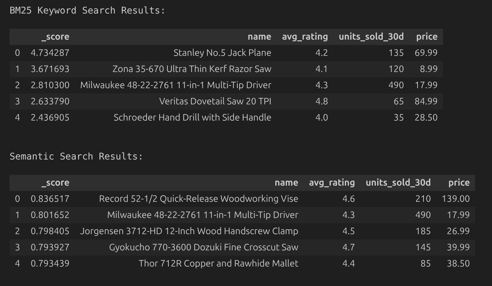
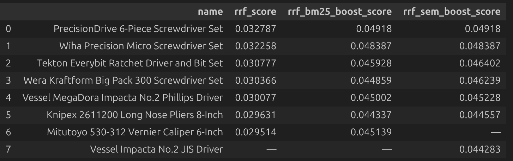
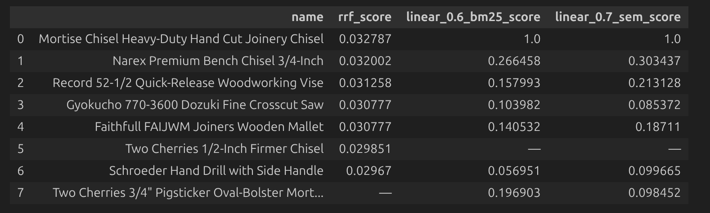
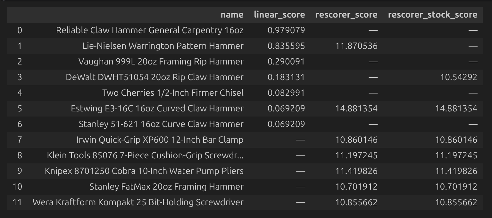

# Beyond Rank Fusion: A Practical Guide to Elasticsearch Retrievers
*Demonstration of Elastic hybrid fusion capabilities*

This article walks through four Elasticsearch retriever strategies — from the simplest rank-based fusion to a full business-logic rescoring pipeline — showing where each excels, where each falls short, and when to graduate to the next.

---

## What This Article Covers

- Creating an Elastic index based on a synthetic product catalog of hand tools
- Use of weighted and unweighted [RRF retriever](https://www.elastic.co/docs/reference/elasticsearch/rest-apis/retrievers/rrf-retriever)
- Use of the [Linear retriever](https://www.elastic.co/docs/reference/elasticsearch/rest-apis/retrievers/linear-retriever) to merge results based on normalized scores
- Use of the [Rescorer retriever](https://www.elastic.co/docs/reference/elasticsearch/rest-apis/retrievers/rescorer-retriever) to refine Linear results with application of business logic

---

## Architecture


- An Elastic Serverless project is provisioned via Terraform
- A product catalog is indexed with dual fields — BM25 text and Jina v5 semantic embeddings via the Elastic Inference Service
- Hybrid retrieval scenarios demonstrate RRF, Linear, and Rescorer fusion strategies side by side

---

## Dataset

This dataset was AI-generated and represents a product catalog of hand tools.  The majority of the catalog is randomly generated products with both product details and business signals such as `avg_rating`, `units_sold_30d`, and an `in_stock` flag.  Below is one such product catalog entry:

```json
  {
    "product_id": "HAM-004",
    "name": "Milwaukee 48-22-9040 Milled-Face Framing Hammer",
    "description": "Designed for professional framing contractors, the milled striking face grips nails to prevent glancing blows. Anti-vibration system absorbs shock through the steel I-beam handle.",
    "category": "Hammers & Mallets",
    "brand": "Milwaukee",
    "price": 49.99,
    "avg_rating": 4.7,
    "units_sold_30d": 175,
    "in_stock": true
  }
```

Of note, there are a number of `Trap` items in the catalog that are specifically contrived to demonstrate a point with the various hybrid search strategies explored in the notebook.  Below is an example of one of those:

```json
  {
    "product_id": "TRAP-A1",
    "name": "PrecisionDrive 6-Piece Screwdriver Set",
    "description": "Precision screwdriver set for electronics repair.1 Precision-ground tips on precision handles with precision grip zones. Each precision screwdriver is magnetised for precision fastener control. Precision electronics repair toolkit.",
    "category": "Screwdrivers & Bits",
    "brand": "PrecisionDrive",
    "price": 34.99,
    "avg_rating": 3.6,
    "units_sold_30d": 95,
    "in_stock": true,
    "trap_for": "weighted_rrf_bm25_strong_knn_weak"
  }
```

---

## Lexical vs Semantic Baseline

Below are the results of lexical and semantic searches on this query:  `versatile fastening tool for woodworking joints`.  Observations:
- Lexical rewards exact keyword overlap — "fastening" and "woodworking" score well.
- Semantic uses Jina embeddings to surface products that may never use the keywords in the query, but are conceptually relevant


---

## Hybrid with RRF

Since neither lexical nor semantic search alone gives the best results, the natural next step is to fuse them. RRF (Reciprocal Rank Fusion) is the simplest approach — it merges ranked lists from multiple retrievers using rank positions only, never looking at the actual scores.

Three RRF scenarios are run with the query `precision screwdriver for electronics repair`: unweighted, weighted favoring lexical (BM25), and weighted favoring semantic.

Items of note:
- **Trap A1** (“PrecisionDrive 6-Piece”) and **Trap A2** (“Vessel Impacta JIS Driver”) are present in this scenario. 
- **A1** is keyword-stuffed — its description repeats “precision screwdriver” without adding real product detail. A1 has been gamed to rank well on *both* BM25 and semantic legs, so RRF keeps it near the top.
- **A2** is the opposite: its description richly describes electronics repair work (circuit boards, soldering, cramped enclosures) without using the query’s keywords. This makes it semantically strong but nearly invisible to BM25 — and since RRF averages ranks from both legs, A2 gets dragged down or drops out entirely.
- **A1 (PrecisionDrive)** sits at #1 across all three columns — keyword stuffing games both retrievers, so no amount of RRF reweighting dislodges it.
- **A2 (Vessel Impacta)** is absent from unweighted RRF and BM25-boosted RRF entirely. It only appears when semantic is boosted — and even then it's dead last (#7), still below A1.
- **A3 (Wiha)** — the genuinely relevant product — is #2 in every column but can never overtake the keyword-stuffed A1.
- **Mitutoyo** (a caliper, not a screwdriver) appears in unweighted and BM25-boosted RRF but drops out under semantic boost — semantic search correctly identifies it as irrelevant.
- **Knipex** (pliers) appears in all three columns, hovering near the bottom — it's marginally relevant on both legs, so reweighting doesn't remove it.
- **Takeaway:** hybrid search does not automatically neutralise keyword stuffing. Rank fusion alone is not enough — you need score-aware fusion (Linear) and business-signal rescoring (Rescorer) to fix this.



---

## Hybrid with Linear

The Linear retriever combines actual score values instead of just ranks. With MinMax normalization, scores from different retrievers are mapped to a common 0–1 scale before weighting. The query used here is `mortise chisel for hand-cut joinery`.


The table below compares RRF (rank-based) against two Linear retrievers (score-based) with different weight splits. All scores are MinMax-normalised to 0–1 for the Linear columns.

Items of note:
- **Mortise Chisel Heavy-Duty** scores 1.0 in both Linear columns — it dominates both BM25 and semantic by such a margin that MinMax maps it to the ceiling. RRF can't express this dominance; it just sees "rank 1."
- **Two Cherries Pigsticker** appears in both Linear columns but not in RRF. Linear's score awareness surfaces it; RRF's rank cutoff drops it.
- **Two Cherries Firmer Chisel** is the reverse — it appears in RRF but not in either Linear column. It ranked well enough on both legs for RRF but its actual scores were too low for Linear to keep it.
- **Narex vs Pigsticker**: under BM25-heavy weights (0.6), Pigsticker (0.20) is competitive with Narex (0.27). Shift to semantic-heavy weights (0.7) and Pigsticker collapses to 0.10 while Narex rises to 0.30 — the gap triples. Pigsticker's relevance was propped up by BM25 keyword matching; semantic search sees through it.
- **Gyokucho** (a saw, not a chisel) drops from 0.10 → 0.09 when semantic weight increases — semantic search penalises it slightly more than BM25 does.
- **Takeaway:** Linear sees the *magnitude* of scores, not just their rank. When the Mortise Chisel scores 52 on BM25 and the next product scores 11, Linear respects that gap — RRF does not. The weight dial now has real teeth: shifting from BM25-heavy to semantic-heavy collapsed the Pigsticker’s score by half while lifting Narex, exposing which products have genuine semantic relevance versus keyword-only relevance.
- **But Linear has a blind spot:** it still operates purely on retrieval scores — it has no idea what `avg_rating` or `units_sold_30d` are, and it cannot penalise out-of-stock products or promote bestsellers. For that, we need the Rescorer.




---

## Hybrid with Rescorer


The Rescorer wraps a first-stage retriever (here, Linear) and applies a script score that can incorporate business signals like ratings, sales velocity, and stock status. In this demo, the rescoring formula blends the Linear relevance score with two business signals: it boosts products proportionally to their sales volume (using a logarithmic scale so a 10x sales difference doesn't produce a 10x score jump) and scales by how close the average rating is to 5.0. A separate stock-aware variant multiplies the entire score by 0.1 when `in_stock` is `false`, effectively removing out-of-stock products from the results.

**Query:** *"reliable claw hammer for general carpentry"*

**Reading guide — what to look for row by row:**

| Product | `linear_score` | `rescorer_score` | `rescorer_stock_score` | What happened |
|---------|---------------|-----------------|----------------------|---------------|
| Reliable Claw Hammer | 0.98 (rank 1) | — | — | Best text match but `avg_rating` 1.9 and `units_sold_30d` 14 → business signals are so weak the rescorer drops it out of the top 7 entirely |
| **Lie-Nielsen Hammer** | **0.84 (rank 2)** | **11.87** | **—** | Strong text match *and* strong business signals (rating 4.8, 310 sold) push it to rescorer #2 — but `in_stock: false` triggers the stock penalty, removing it from rescorer+stock |
| Estwing E3-16C | 0.07 | 14.88 (rank 1) | 14.88 (rank 1) | Low text relevance but the best business signals in the set (rating 4.9, 1840 sold) → rescorer vaults it to #1, and it stays #1 with stock filter since it's in stock |
| Knipex, Klein, Irwin, Wera | — | ~10.9–11.4 | ~10.9–11.4 | Not in the linear top 7 at all, but the rescorer's `window_size: 50` rescores all 50 candidates — these products have strong business signals that overcame their low relevance |

The **Lie-Nielsen row** is the key demonstration: a product can rank well on relevance *and* business signals, yet still be excluded by a single boolean filter. This is the kind of business logic that neither RRF nor Linear can express.


**Takeaway:** The Rescorer doesn't change what gets *retrieved* — it changes what gets *promoted*. The candidate set comes from your best hybrid retriever. The Rescorer then layers on business logic that no query can express. Notice the **Lie-Nielsen Warrington Pattern Hammer**: it ranks #2 in the linear baseline and earns a strong rescorer score (11.87) thanks to its high `avg_rating` (4.8) and 310 units sold — but it vanishes from the `rescorer_stock` column because `in_stock` is `false`. One boolean field overrides all the relevance and popularity signals. That is the power of the Rescorer: it lets you inject hard business constraints *after* fusion, so out-of-stock products never reach the customer no matter how relevant they are.




---

## Summary:  When to use each retriever

- **RRF (unweighted):** Good starting point when you have multiple retrieval signals and no prior knowledge about which matters more. Zero tuning required.
- **RRF (weighted):** When you know one retrieval method is more reliable for your domain — e.g., boost semantic weight for natural-language queries, boost BM25 for part-number lookups.
- **Linear + MinMax:** When score magnitude matters — products that are dramatically more relevant should rank dramatically higher, not just one rank position above. Requires some weight tuning.
- **Rescorer:** When business logic must influence final rankings — popularity, ratings, stock status, recency, margin, or any field-level signal that pure text relevance cannot capture.

| Retriever          | Fusion method       | Score magnitude? | Weights? | Business logic? | Best for |
|--------------------|---------------------|------------------|----------|-----------------|----------|
| RRF (unweighted)   | Rank-based          | No               | No       | No              | Zero-config starting point |
| RRF (weighted)     | Rank-based          | No               | Yes      | No              | Domain-tuned retrieval (e.g., BM25 for part numbers) |
| Linear + MinMax    | Score-based         | Yes              | Yes      | No              | Relevance-sensitive ranking where score gaps matter |
| Rescorer           | Score-based + rerank| Yes              | Yes      | **Yes**         | E-commerce, catalogs — anywhere stock, ratings, or margin must influence results |

---

## Conclusion

The progression from RRF to Linear to Rescorer is not about replacing one retriever with another — it is about layering capability as your requirements demand it. Start with RRF when you have multiple signals and no tuning budget. Graduate to Linear when you need the ranking to reflect how *much* more relevant one product is than another. Add the Rescorer when pure relevance is not enough and business constraints — popularity, stock status, margin — must be factored in. Each step builds on the last, and Elasticsearch's retriever API makes it straightforward to move up the ladder without rearchitecting your search pipeline.

---

## Source Code

The full source is available here:

https://github.com/joeywhelan/beyond-rrf

---